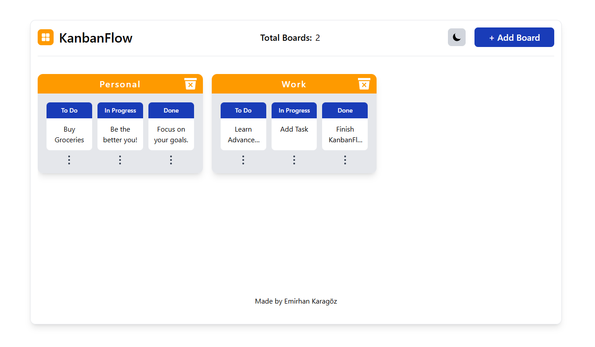
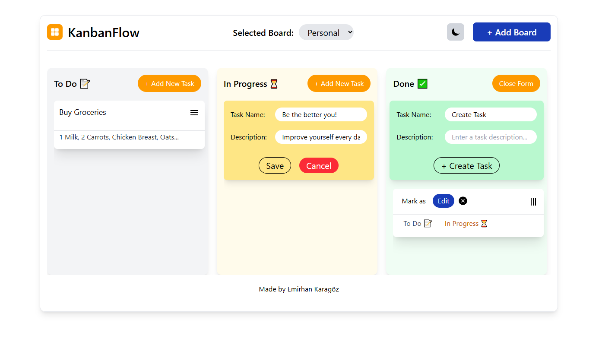
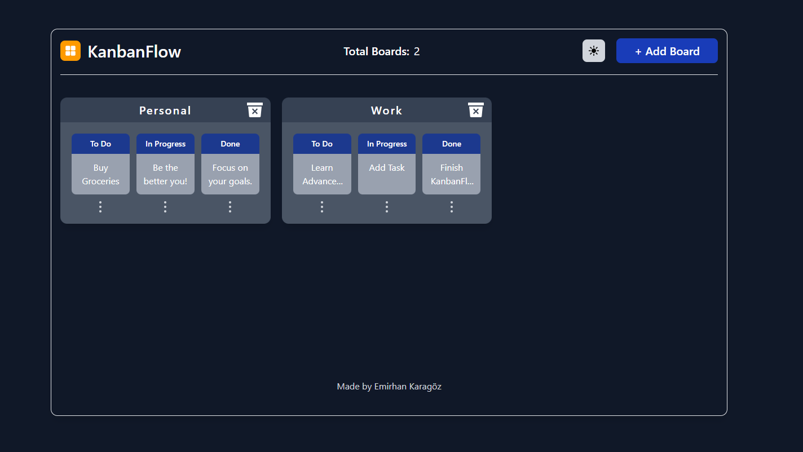
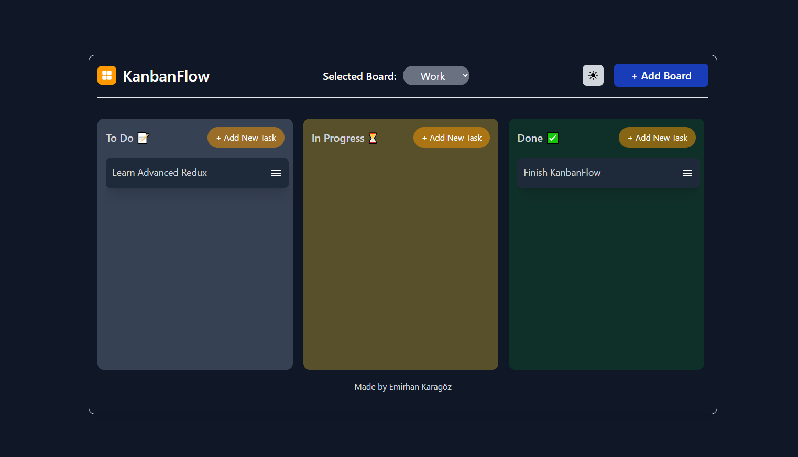

# KanbanFlow 🌍

**A Trello-inspired task management application designed to organize work using boards, lists, and cards**

---

## Table of Contents

1. [About the Project](#about-the-project)
2. [Features](#features)
3. [Screenshots](#screenshots)

- [Prerequisites](#prerequisites)
- [Installation](#installation)

4. [Usage](#usage)
5. [License](#license)
6. [Contact](#contact)

---

## About the Project

KanbanFlow is a Trello-inspired task management application designed to organize work using boards, lists, and cards. Users can create multiple boards (e.g. Personal, Work), each containing lists such as To Do, In Progress, and Done, and manage tasks as draggable cards within these lists. The app uses Redux Toolkit for predictable global state management, separating board, list, task, and UI state to ensure scalability and clarity. With features like task CRUD operations based on a json-server, drag-and-drop interactions, theme toggling, and state persistence, KanbanFlow demonstrates real-world state management patterns in a clean, modern React application—making it ideal as a portfolio project.

## Features

- **Custom Boards**: Create a board with desired name.
- **Custom Tasks**: Add, edit, and delete tasks.
- **Drag and Drop**: Drag and drop boards and Tasks and organize them according your desire.
- **Dark Mode**: Too dark? change it to dark mode.
- **Responsive Layout**: Use it on your mobile phone or tablets.

---

## Screenshots

### Boards

### Tasks

### Dark Mode

---

## Usage

1. **Add a board**: Click on [+ Add Board] button and give a name.
2. **Select a board**: Click on a board to view tasks.
3. **Add a new task**: Add name, and desctription, and change later if you want.
4. **Mark the task**: Mark a task as "In Progress", "Done", or "To Do".

---

## License

Distributed under the MIT License. See `LICENSE` for more information.

---

## Contact

Emirhan Karagöz - [emirhan-karagoz1@hotmail.com](mailto:emirhan-karagoz1@hotmail.com)

Project Link: [GitHub Repository](https://github.com/Wallinera/KanbanFlow)

Live Site URL: [KanbanFlow.vercell.app](https://world-wide-omega.vercel.app)
